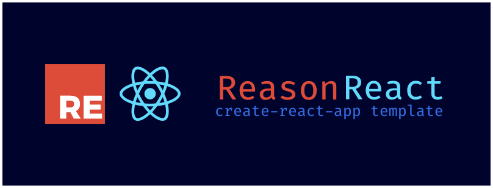

<p align="center">
  <br />
   
</p>
<p align="center">
   <a href="#usage">Usage</a> • 
   <a href="#project-structure">Project Structure</a> •
   <a href="#alternative">Alternative</a>
</p>
<br/>
<br/>

## Usage

First run the below commands to start create new project:
```bash
npx create-react-app <project_name> --template @reason-id/cra-template
```

## Project Structure

```
.
├── bsconfig.json
├── .gitignore
├── public
│   ├── favicon.ico
│   ├── index.html
│   ├── logo192.png
│   ├── logo512.png
│   ├── manifest.json
│   └── robots.txt
├── README.md
└── src
    ├── App.css
    ├── App.re
    ├── index.css
    ├── index.js
    ├── index.re
    ├── logo.svg
    ├── reportWebVitals.js
    └── Router
        ├── Route.re
        ├── Route.rei
        └── Router.re
```
   
## Alternative
* [**Spin**](https://github.com/tmattio/spin)(we use [Router](https://github.com/reason-id/cra-template/tree/feat/v0.0.1/template/src/Router) from [Spin](https://github.com/tmattio/spin))
* [**app-template-reason-react**](https://github.com/jihchi/app-template-reason-react) for [Snowpack](snowpack.dev)
* [**vite-reason-react-template**](https://github.com/tatchi/vite-reason-react-template) for [Vite](https://github.com/vitejs/vite)
